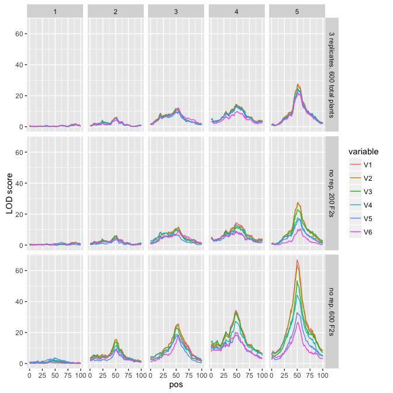

# Untitled


```r
library(qtl)
library(ggplot2)
library(reshape2)
```


```r
chromosomes <- 5
individuals <- 200 # number of individual plants that would be replicated
repl <- 3
```


```r
map <- sim.map(len=rep(100,chromosomes),n.mar=100,include.x = FALSE)
```


```r
cross <- sim.cross(map=map,
                   model = matrix(c(1:chromosomes, #QTL location (chromosome)
                                    rep(50,chromosomes), #QTL position on chromosome
                                    1:chromosomes, # additive effect sizes, ranging from 1 to # of chromosomes
                                    rep(0,chromosomes)), # dominance deviation
                                  nrow = chromosomes, byrow = FALSE), #1 QTL per chromosome at 50cM, increasing effect size 1:12
                   n.ind=repl*individuals,
                   type="f2")
cross <- sim.geno(cross)
```

Add noise to phenotypes

```r
phenotypes <- lapply(0:chromosomes, function(noise) {
  pheno.matrix <- t(apply(cross$pheno,1,rep,repl))
  pheno.matrix <- pheno.matrix + rnorm(n=prod(dim(pheno.matrix)),
                                       mean=0,
                                       sd=noise)
}) #each element of the list is a phenotype matrix of 3 replicates, with increasing amounts of noise added.

  cross.no.rep <- cross
  cross.no.rep$pheno <- as.data.frame(sapply(phenotypes, FUN = function(x) x[,1]))
  cross.with.rep <- cross
  cross.with.rep$pheno <- as.data.frame(sapply(phenotypes, rowMeans))
  cross.with.rep <- cross.with.rep[,1:individuals] # so that the total number of individuals grown is the same 
```

Map 

```r
no.rep.scanone <- scanone(cross.no.rep,pheno.col=1:(chromosomes+1),method = "imp")
with.rep.scanone <- scanone(cross.with.rep,pheno.col=1:(chromosomes+1),method = "imp")
```

Map replicated

```r
no.rep.scanone.melt <- melt(no.rep.scanone,id.vars = c("chr","pos"))
no.rep.scanone.melt$type <- "no replication"
with.rep.scanone.melt <- melt(with.rep.scanone,id.vars = c("chr","pos"))
with.rep.scanone.melt$type <- "with replication"
combined.scanone <- rbind(no.rep.scanone.melt,with.rep.scanone.melt)
pl <- ggplot(combined.scanone,aes(x=pos,y=value,color=variable))
pl <- pl + facet_grid(type ~ chr) 
pl <- pl + geom_line()
pl + ylab("LOD score")
```




