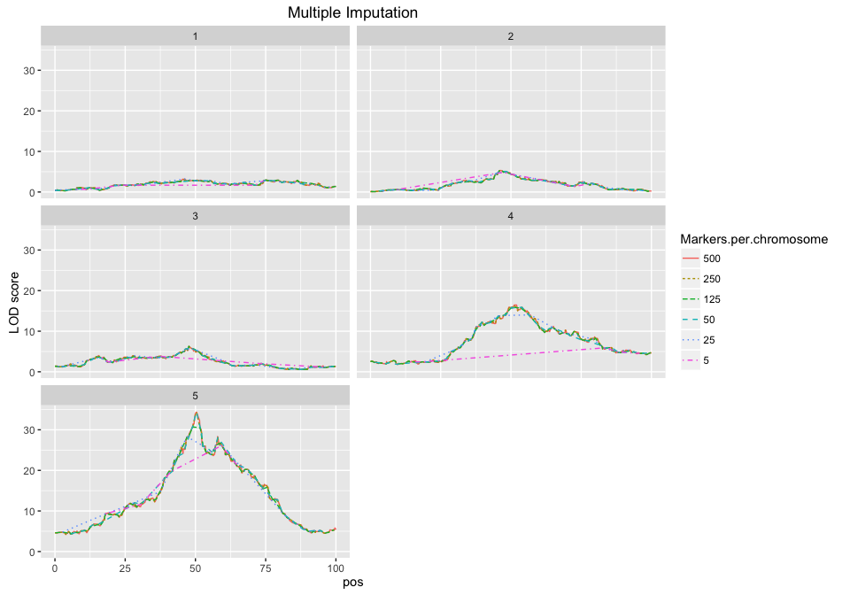
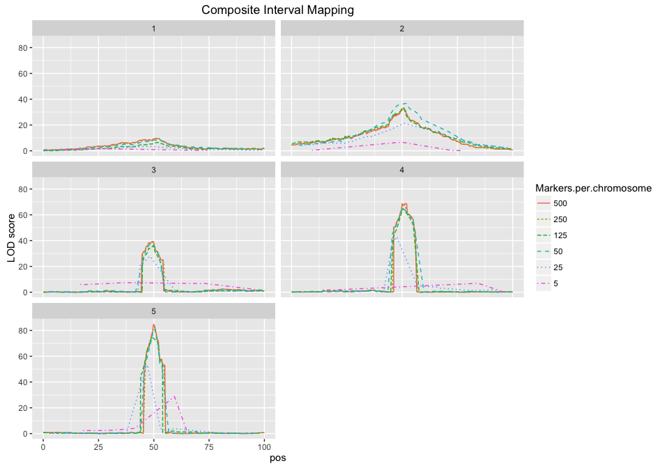

# QTL simulations

### Intro

The goal is to determine the effect of increasing marker number on mapping resolution

### Load Libraries

```r
library(qtl)
library(ggplot2)
```

```
## Warning: package 'ggplot2' was built under R version 3.2.4
```

```r
library(reshape2)
library(plyr)
```

```
## Warning: package 'plyr' was built under R version 3.2.5
```

### Set up parameters.

```r
chromosomes <- 5
individuals <- 250 # number of individual plants that would be planted
markers <- 500 # number of markers per chromsomes in largest cross
drops <- c(.5,.75,.9,.95,.99) # proportion of markers to drop
```

### Simulate a genetic map.

```r
map <- sim.map(len=rep(100,chromosomes),n.mar=markers,include.x = FALSE)
```

### Simuate a QTL Cross
One QTL per chromosome, in the middle.  
The QTL effect size varies, increasing as we move from chromosome to chromosome.

```r
cross <- sim.cross(map=map,
                   model = matrix(c(1:chromosomes, #QTL location (chromosome)
                                    rep(50,chromosomes), #QTL position on chromosome
                                    1:chromosomes, # additive effect sizes, ranging from 1 to # of chromosomes
                                    rep(0,chromosomes)), # dominance deviation
                                  nrow = chromosomes, byrow = FALSE), #1 QTL per chromosome at 50cM, increasing effect size
                   n.ind=individuals,
                   type="f2")
```

### Create crosses with fewer markers

```r
marker.names <- lapply(map,names)
small.crosses <- lapply(drops,function(d) {
  markers.to.drop <- unlist(lapply(marker.names,sample,d*markers,replace=FALSE))
  drop.markers(cross,markers.to.drop)
})
all.crosses <- c(list(cross),small.crosses)
names(all.crosses) <- c(markers,(1-drops) * markers)
```

### Do the QTL mapping
Use scanone, imputation method.

```r
all.crosses <- lapply(all.crosses, sim.geno)
all.scanone <- lapply(all.crosses,scanone,pheno.col=1,method = "imp")
all.cim <- lapply(all.crosses,cim,pheno.col=1,method="imp")
```

### Plot the scanone results

```r
all.scanone.df <- ldply(all.scanone,.id="Markers.per.chromosome")

pl <- ggplot(all.scanone.df,aes(x=pos,y=lod,color=Markers.per.chromosome,lty=Markers.per.chromosome))
pl <- pl + facet_wrap(~ chr,ncol=2) 
pl <- pl + geom_line()
pl + ylab("LOD score") + ggtitle("Multiple Imputation")
```

<!-- -->


### Plot the CIM results

```r
all.cim.df <- ldply(all.cim,.id="Markers.per.chromosome")

pl <- ggplot(all.cim.df,aes(x=pos,y=lod,color=Markers.per.chromosome,lty=Markers.per.chromosome))
pl <- pl + facet_wrap(~ chr,ncol=2) 
pl <- pl + geom_line()
pl + ylab("LOD score") + ggtitle("Composite Interval Mapping")
```

<!-- -->

